# 고전압 방전현상 시뮬레이터 v18 — 24 시간 이내 실행을 위한 속도 개선

v17(`needle_plane_discharge_hmi_20060915_2.py`, 원본은 `legacy/`에 보존)은 기본 조건(침-평판 10 mm,
+30 kV 0.01/0.1 µs 임펄스, nx=161)에서도 하루 안에 끝나지 않았습니다. 원인을 계측으로 확인하고
물리 모델은 그대로 둔 채 수치해법·실행 구조를 바꿔, **같은 조건이 1 분 안에 끝나도록** 했습니다.

| 파일 | 역할 |
|---|---|
| **`main.py`** | **통합 실행 진입점** (실행 파일이 호출하는 파일). GUI / 배치 / 자체점검 |
| `needle_plane_discharge_hmi.py` | v18 GUI (v17 HMI 8개 탭 그대로, 코어만 교체 + 재렌더링 분리) |
| `discharge_core.py` | v18 물리 코어 (GUI 없이 import 가능). v17 모델 + 속도 개선 |
| `run_batch.py` | 헤드리스 배치 실행기: 그림 7종 + CSV + 소요시간 보고서 자동 생성 |
| `discharge_export.py` | CSV 저장 (GUI/배치 공용, v17 형식 동일) |
| **`build_exe.py`, `build_exe.bat`, `build_exe.sh`** | **GUI 포함 단독 실행 파일(.exe) 빌드** |
| `benchmark.py` | v17 원본 코어 vs v18 속도·결과 비교 |
| `tests/test_core.py`, `tests/test_gui_smoke.py`, `tests/test_entrypoint.py` | 회귀 테스트 (코어 / Xvfb GUI / 진입점·실행 파일) |
| `legacy/` | v17 원본 파일과, 그 물리 코어를 원문 그대로 잘라낸 `core_v17.py` (기준값용) |
| `results/` | 이 문서의 모든 그림·로그·`timing.json` |

---

## 0. 실행 방법

### 0.1 파이썬으로 실행 (개발·연구용)

```bash
pip install -r requirements.txt                 # numpy, scipy, matplotlib
python main.py                                  # GUI 실행 (권장 진입점)
python main.py --batch --afterglow_us 10        # 헤드리스 배치 -> results/run_.../
python main.py --selftest                       # 의존성·코어 자체점검
python needle_plane_discharge_hmi.py            # GUI 직접 실행 (v17 과 같은 사용법)
python run_batch.py --R_series 1000 --t_end_ns 300 --afterglow_us 10   # 직렬저항 회로
python tests/test_core.py                       # 회귀 테스트 (약 1 분)
```

`main.py` 는 GUI(`needle_plane_discharge_hmi.py`)와 배치(`run_batch.py`)를 하나의 진입점으로 묶은 것으로,
실행 파일이 호출하는 파일도 이것입니다. `tkinter` 는 파이썬 표준 라이브러리이지만 Linux 에서는 별도
패키지입니다(`sudo apt install python3-tk`). Windows 공식 설치본에는 기본 포함됩니다.

### 0.2 GUI 가 포함된 단독 실행 파일 만들기

파이썬·numpy·scipy·matplotlib·tkinter 를 모두 포함하므로, **배포 대상 PC 에 파이썬을 설치하지 않아도**
더블클릭으로 실행됩니다.

```bat
:: Windows  (build_exe.bat 을 더블클릭해도 됩니다)
build_exe.bat                 :: 폴더형 (권장)
build_exe.bat --onefile       :: 단일 HVDischargeSim.exe
```
```bash
# Linux / macOS
./build_exe.sh                # 폴더형
./build_exe.sh --onefile      # 단일 실행 파일
# tkinter 가 있는 다른 파이썬을 쓰려면:  PYTHON=/usr/bin/python3.12 ./build_exe.sh
```

| 형태 | 결과물 | 배포 크기 | 시작 시간 | 언제 |
|---|---|---|---|---|
| 폴더형 (기본) | `dist/HVDischargeSim/` 폴더 전체 | 272 MB | 1.3 s | 사내 공유·USB 등 폴더째 전달 |
| 단일 파일 | `dist/HVDischargeSim(.exe)` 파일 하나 | 78 MB | 2.3 s (Windows 는 10~30 s) | 메일·메신저로 파일 하나만 전달 |

빌드된 실행 파일의 사용법 (GUI 는 인자 없이 실행):

```bat
HVDischargeSim.exe                                  :: GUI 실행
HVDischargeSim.exe --batch --afterglow_us 10        :: 헤드리스 배치 (exe 옆 results/ 에 저장)
HVDischargeSim.exe --selftest                       :: 의존성·코어 자체점검
HVDischargeSim.exe --gui-selftest 20                :: GUI 를 20 초 돌려 8개 탭 그림 저장
HVDischargeSim.exe --version                        :: 버전·의존성 확인
```

**이 저장소에서 실제로 빌드·검증한 결과** (Linux, Python 3.12, PyInstaller 6.22.3):

| 점검 | 폴더형 | 단일 파일 |
|---|---|---|
| 빌드 시간 / 크기 | 25 s / 272 MB | 31 s / 78 MB |
| `--selftest` (scipy 직접해법 활성, 코어 30 서브스텝, 그림 저장) | OK (1.3 s) | OK (2.3 s) |
| `--gui-selftest` (창 1460×950, 8개 탭, 15~19 s 계산) | OK (1,788 서브스텝) | OK (1,374 서브스텝) |
| `--batch --t_end_ns 5` (그림 7종 + timing.json) | OK (16 s) | OK |
| `tests/test_entrypoint.py <실행파일>` | PASS | PASS |

검증 로그와 실행 파일 GUI 가 실제로 그린 8개 탭 그림은 `results/exe_build_check/` 에 있습니다.

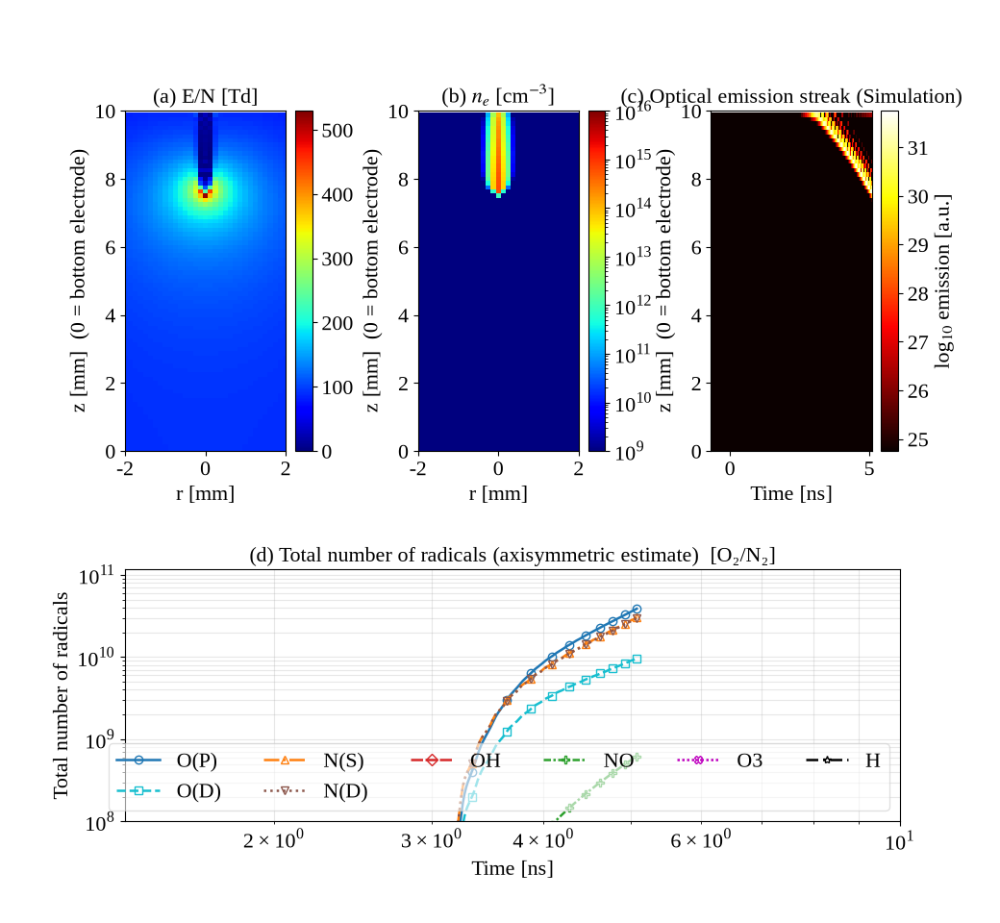

주의사항
* 실행 파일은 **빌드한 OS 용으로만** 동작합니다. Windows 용 `.exe` 는 Windows 에서 빌드하십시오
  (이 저장소의 검증은 Linux 바이너리로 수행했고, 빌드 스크립트는 OS 공통입니다).
* 서명하지 않은 실행 파일이라 Windows SmartScreen 이 "알 수 없는 게시자" 경고를 낼 수 있습니다
  ("추가 정보 → 실행"). 백신이 PyInstaller 산출물을 오탐할 수 있으니 사내 배포 시 예외 등록이 필요할 수 있습니다.
* GUI 실행 파일은 콘솔 창이 없으므로, 오류가 나면 실행 파일 옆에 `error_log.txt` 가 저장됩니다.
  원인을 바로 보려면 `python build_exe.py --console` 로 콘솔 포함 빌드를 하십시오.
* `build/`, `dist/`, `*.spec` 은 빌드 산출물이라 저장소에 포함하지 않습니다(`.gitignore`).

---

## 1. 왜 v17 은 24 시간이 넘게 걸렸나 (계측 결과)

측정 환경: Xeon 2.1 GHz 1 코어(numpy/scipy 단일 스레드), Python 3.11, 기본 조건 nx=161 (격자 161×125).

| 항목 | v17 측정값 | 설명 |
|---|---|---|
| 서브스텝당 시간 | **74 ms** | 그중 88 %가 `np.roll` 기반 적-흑 SOR 포아송(서브스텝당 60회 반복) |
| 초기화 | 6.5 s | SOR 2500+2000+400 회 |
| dt (스트리머 진전 중) | 1.9 → 0.3 ps | 유전완화 한계 `0.5·ε0/(q·max nₑ·max μ)` — 격자 최대 이동도(저전계 0.1 m²/Vs)와 최대 밀도를 곱해 과소평가 |
| **갭 브리징 후 dt** | **0.005 ps (5 fs)** | 스트리머가 평판에 닿은 뒤 밀도가 상한 1e22 에 걸리면 종별 독립 `clip` 이 인위적 순전하를 만들어 \|E\| 가 3×10⁶ kV/cm 로 발산 → CFL dt 붕괴 (`results/smoke_20ns/progress.csv`) |
| GUI 재렌더링 | 6 서브스텝마다 8개 탭 전부 | 재렌더링 1회 ≈ 1.3 s (Xvfb 측정) → 계산보다 그리기가 오래 걸림 |

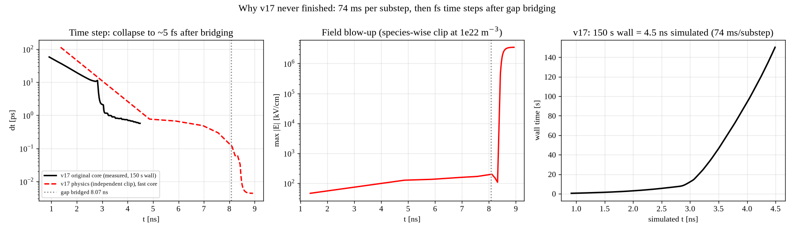

v17 dt 규칙으로 브리징(8.6 ns)까지 필요한 서브스텝은 28,794개입니다. 헤드리스로도 35 분,
GUI 로는 약 2 시간이고, 브리징 이후에는 1 ns 진행에 2×10⁵ 서브스텝(헤드리스 4 시간, GUI 12 시간 이상)이
필요해 임펄스 전 구간(300 ns)은 사실상 끝나지 않습니다. 사용자가 체감한 "무한히 느려짐"의 직접 원인은
이 브리징 이후 dt 붕괴입니다.

## 2. 무엇을 바꿨나 (물리 모델·입력·GUI 표기는 v17 과 동일)

| # | 변경 | 효과 |
|---|---|---|
| 1 | **포아송 방정식을 희소행렬 직접해법(scipy SuperLU)으로 교체.** 기하가 고정이므로 LU 분해는 1회, 매 스텝은 전진/후진 대입만 | 65 ms → 1 ms. v17 SOR 의 고정점과 **같은 선형계**를 풀므로 결과는 "v17 을 무한히 반복시킨 것"과 동일 (§3.1) |
| 2 | 반응률 보간: 서브스텝마다 15회의 log-log `np.interp` → 균일 log(E/N) 격자 8000점 LUT 1회 인덱싱 + 종별 gather. 조성 고정이므로 ν_ion=Σk·n 등 합성 테이블을 초기화 시 생성 | 4 ms → 0.7 ms (v17 대비 상대오차 < 0.5 %, 테이블 꺾임점에서만) |
| 3 | 유전완화 dt 를 물리적으로 올바른 `τ_d = ε0/max σ`, `σ = q(μₑnₑ+μ₊n₊+μ₋n₋)` 로 계산 (`dt_rule="v17"` 로 되돌릴 수 있음) | 브리징까지 서브스텝 28,794 → 15,090 (브리징 시각 8.072 → 8.059 ns, 0.2 % 차이) |
| 4 | 밀도 상한 처리: 전자·양이온 쌍 생성을 상한 내로 제한하고, 상한 초과 시 세 종을 같은 비율로 축소해 **전하중성 보존** | 브리징 후 전계 발산·fs dt 붕괴 제거 |
| 5 | **갭 브리징 자동 감지**(축상 nₑ 전 구간 > 1e18 m⁻³): 배치는 방전 단계를 멈추고 잔광 단계로, GUI 는 상태창 표시 + 'Auto afterglow' 자동 전환. dt 가 0.01 ps 아래로 20 서브스텝 연속이면 `stalled` 로 정지 | 유체 모델의 유효 범위(스트리머-스파크 전이 이전)에서 항상 끝남 |
| 6 | **외부 회로 직렬저항 R** (선택, 기본 0 = v17 과 같은 이상 전압원): Sato 공식 방전전류 `I=∫σE·E_L dV`(축대칭 환산), `V_needle=(V_src−R·I_ρ)/(1+R·G)` 암시적 갱신 | 브리징 후 전압붕괴(스파크 전이)를 재현하며 임펄스 전 구간 실행 가능. 파형 탭에 V_needle, I(t) 추가 |
| 7 | **적응형 반암시적 포아송**(Ventzek–Hagelaar): 유전완화 한계가 다른 한계보다 8배(`semi_ratio`, ≈LU 재분해/명시적 스텝 비용비) 이상 작을 때만 `∇·[(ε₀ε_r+dt·σ)∇V]=−ρ` 로 재조립·재분해(σ 변화 10 % 이내면 분해 재사용) | 도전 채널 단계에서 dt 0.04 ps → 0.86 ps, 벽시계 3.9배 단축 (§3.3) |
| 8 | GUI: 'Compute per tick'(0.25 s, 직전 재렌더링 시간의 2배 이상으로 자동 확대) 동안 연속 계산, 'Redraw interval'(2 s)마다 한 번만 재렌더링. 'Run until t_end', 벽시계/속도/dt 제한요인/전류 상태 표시 | 계산 비중 ≥ 2/3 보장 |
| 9 | 초기화 6.5 s → 0.1 s; `run_until()` 헤드리스 API; 미설치 글꼴 경고 폭주 방지 | |
| 10 | (버그 수정) v16 형상 접지전극 구성(침-침, 구-구, 로고우스키)에서 v17 SOR 이 gnd 셀을 미지수로 갱신해 **잘못된 고정점**(접지 인접 셀 오차 최대 4.6 kV/30 kV)에 수렴하던 문제 — v18 은 gnd 에 정확한 Dirichlet 조건 적용 | |
| 11 | (버그 수정) BOLSIG+ CSV 로 일부 반응률만 교체할 때 CSV 의 E/N 점 수가 13이 아니면 `np.interp` 길이 불일치로 v17 이 예외 — 기본 테이블을 새 격자로 재보간 | |

scipy 가 없으면 v17 SOR 로 자동 폴백합니다(상태창 `Poisson: SOR fallback`).

## 3. 검증

### 3.1 직접해법 = v17 SOR 수렴해 (`results/verify_poisson.py`)
침-평판(접지/부유/유전체 평판), 3침: `max|V₁₈−V₁₇(SOR 6000회)|/max|V| = 3×10⁻¹⁴`, 이산 잔차 4×10⁻¹⁶.
형상 접지전극 구성(§2-10)에서는 v17 SOR 자체가 잘못된 고정점에 수렴하므로 차이가 0.5–24 %이며, v18 의 잔차는 10⁻¹⁶ 입니다.

### 3.2 v18 = "v17 + 수렴된 포아송" (`results/verify_converged.py`, `results/fig_v17conv_vs_v18.png`)
v17 원본 코어를 서브스텝당 SOR 3000회로 돌린 궤적과 v18(dt 규칙 v17)을 0–3 ns 동안 비교:
dt 열이 동일, `max nₑ` 비 1.0000, `max|ΔV|` ≤ 0.4 V (30 kV 중).
반면 **v17 원본(60회)**은 전위가 수렴하지 않아 첫 스텝 후 E_max 가 21 kV/cm(정확해 9.9)로 과대평가되고,
3 ns 시점 `max nₑ` 가 1.3×10²⁰(정확해 1.75×10¹⁹)로 앞당겨 성장합니다 — v17 의 결과 오차이지 v18 의 오차가 아닙니다.

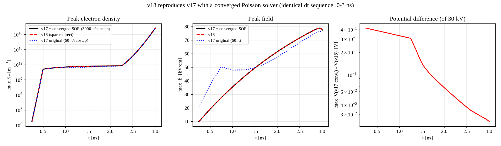

### 3.3 반암시적 vs 명시적 (`results/fig_semi_vs_explicit.png`)
R=1 kΩ, 11 ns 까지: 브리징 8.09 vs 8.06 ns, 이후 전류 24.7 vs 27.6 A(≈V/R), 벽시계 110 s vs 424 s.
브리징 이전 궤적은 동일하고, 이후(스파크 전이, 모델 유효범위 밖)는 정성적으로 일치합니다.

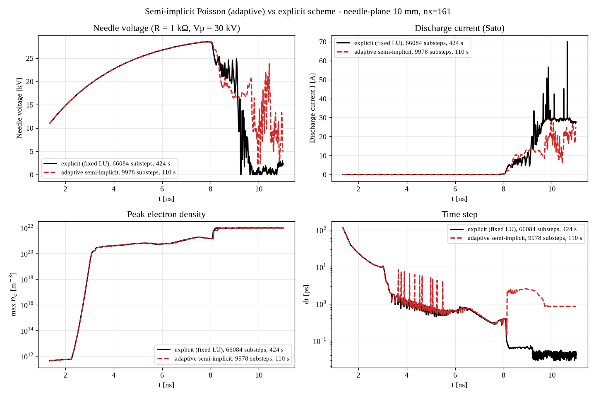

### 3.4 회귀 테스트
`python tests/test_core.py` (4개 항목, 약 60 s) / `xvfb-run -a python tests/test_gui_smoke.py` (GUI 생성·실행·잔광·CSV·구성 변경).

## 4. 실행 결과와 소요 시간

### 4.1 기본 시나리오 (침-평판 10 mm, +30 kV 0.01/0.1 µs, nx=161, 잔광 10 µs) — `results/run_default/`

| 항목 | 값 |
|---|---|
| 갭 브리징 | **t = 8.07 ns** (평균 진전속도 ≈ 1.3 mm/ns, 평판 근처 5 mm/ns) |
| 방전 단계 서브스텝 / 벽시계 | 7,806 / **51–53 s** (6.5–6.8 ms/서브스텝, 포아송 30 %; 3회 반복, 다른 실행 2개와 동시 수행) |
| 잔광 10 µs | < 1 s |
| **총 소요** | **56–59 s** (v17: 브리징까지만 헤드리스 35 분·GUI ≈ 2 시간, 그 이후 진행 불가) |
| 브리징 시점 max nₑ / max \|E\| | 1.5×10²¹ m⁻³ / 168 kV/cm |
| 잔광 10 µs 후 활성종 총개수 | O(P) 1.0×10¹³, O₃ 1.2×10¹³, NO 2.9×10¹², N(S) 3.0×10¹² (스트리머 단계 생성분만; 브리징 후 1 ns 를 더 계산하면 채널 단계 생성으로 2–3 자릿수 증가하나 모델 유효범위 밖) |

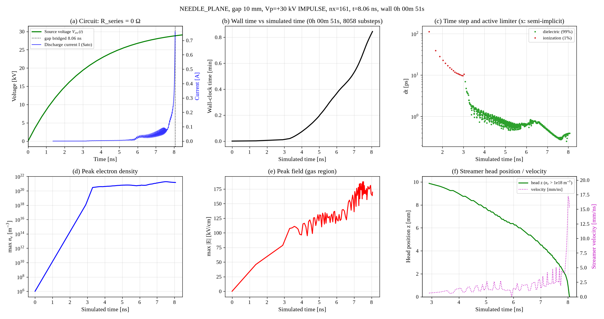
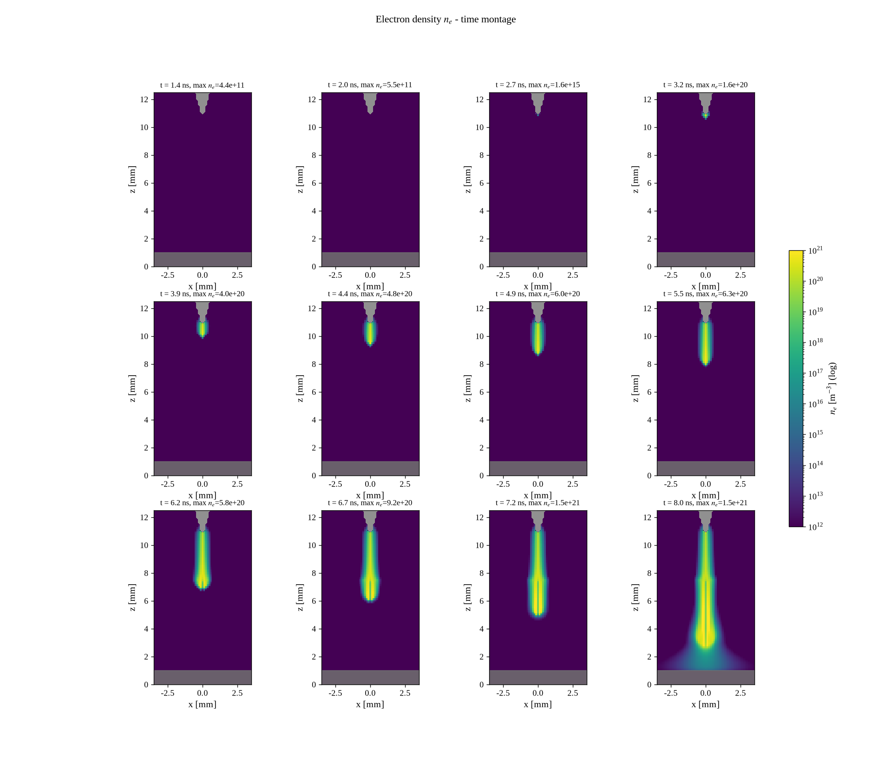
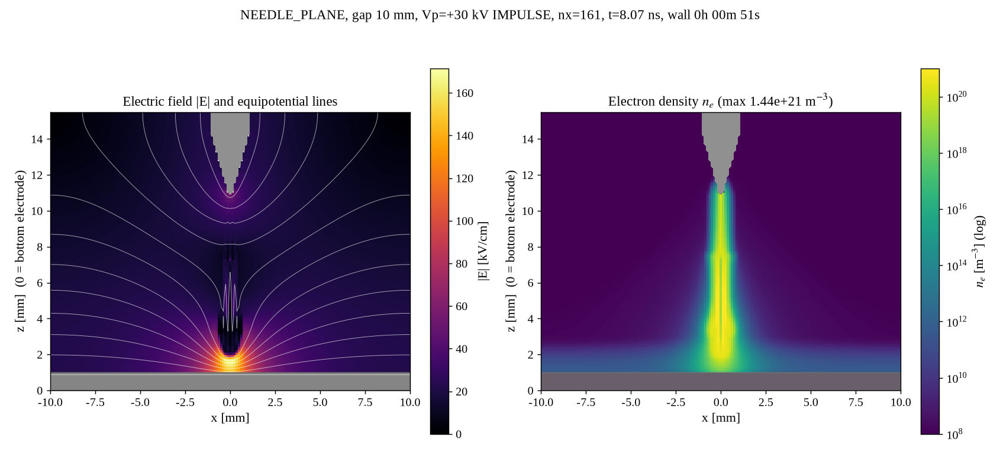
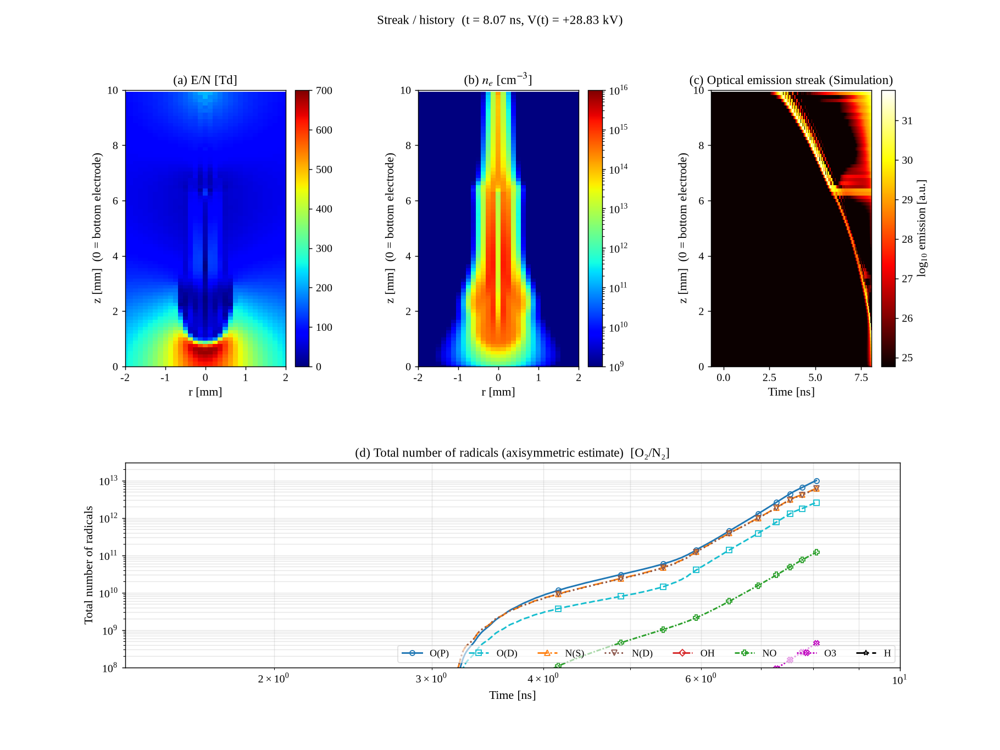
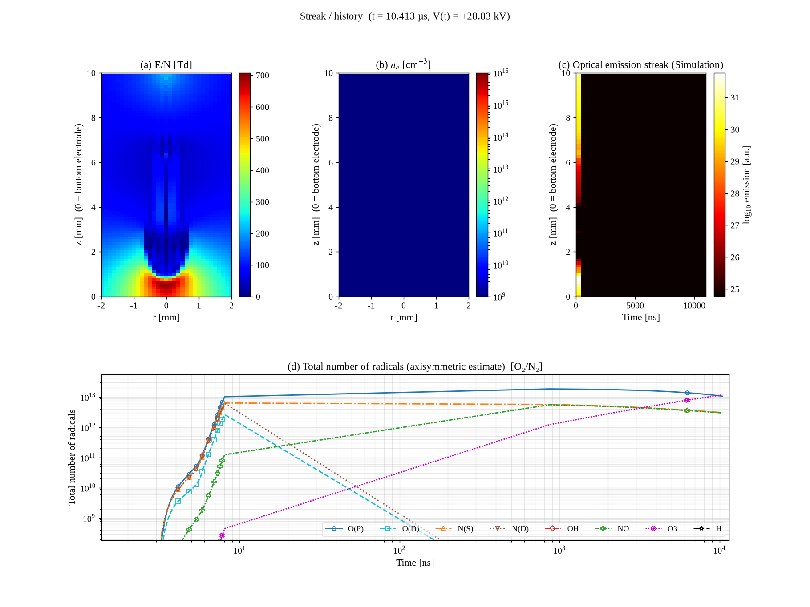

### 4.2 직렬저항 회로로 임펄스 전 구간 (R = 1 kΩ, 0–300 ns) — `results/run_R1000_crashed_plot/`

| 항목 | 값 |
|---|---|
| 갭 브리징 | t = 8.07 ns (브리징까지 벽시계 2 min) |
| 방전 단계 0–300 ns 서브스텝 / 벽시계 | 352,704 / **4 h 40 min** (47.6 ms/서브스텝; 99 %가 반암시적 스텝, dt ≈ 0.86 ps 전리 한계) |
| 전극전압 | 브리징 후 12 ns 에 0.19 kV 까지 붕괴(전류 ≈ V_src/R ≈ 30 A), 이후 음극 시스가 전류를 제한하며 V_needle → V_src 로 회복, 300 ns 에 3.95 kV (= V_src) |
| 결과의 물리적 의미 | **브리징 후 ~10 ns 까지만 유효.** 그 뒤에는 이온 밀도 상한(1e22 m⁻³)에 걸린 음극 시스가 10⁴ kV/cm 급 전계를 만들고 격자 전체가 상한 밀도의 플라즈마로 채워지는 모델 외 영역(§5) |

이 실행은 마지막 그림(지연시간 히스토그램: 위험률 포화로 표본이 한 값)에서 예외가 나 잔광·CSV 는 저장되지 않았습니다.
그 버그는 수정했고, 긴 실행의 결과를 그림 오류로 잃지 않도록 상태 체크포인트(`state_*.npz`)·`timing_discharge.json`
선저장·그림별 예외 격리를 추가했습니다. 아래 그림은 `progress.csv` 로부터 재구성한 것입니다.

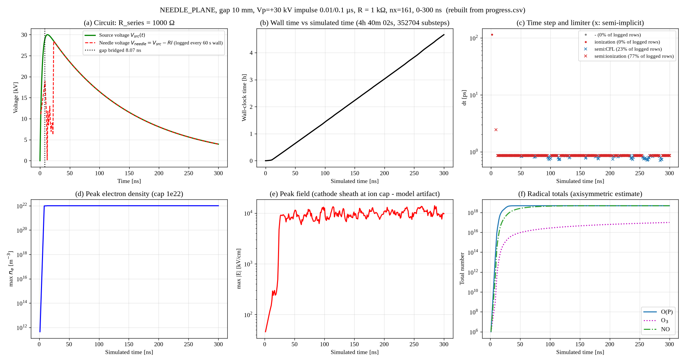

물리적으로 의미 있는 전압붕괴 구간(0–20 ns)만 다시 실행한 결과(`results/run_R1000_20ns/`, 잔광 10 µs 포함):

| 항목 | 값 |
|---|---|
| 갭 브리징 / 총 소요 | 8.07 ns / **11 min 02 s** (20,736 서브스텝, 31.5 ms/서브스텝; 브리징 후 62 %가 반암시적) |
| 전극전압 | 브리징 직후 29 kV → 0–15 kV 로 붕괴(진동), 전류 20–40 A(최대 74 A) ≈ V_src/R |
| 잔광 10 µs 후 | 그림 `fig3_radicals_afterglow.png`, `fig4_paper_afterglow.png` |

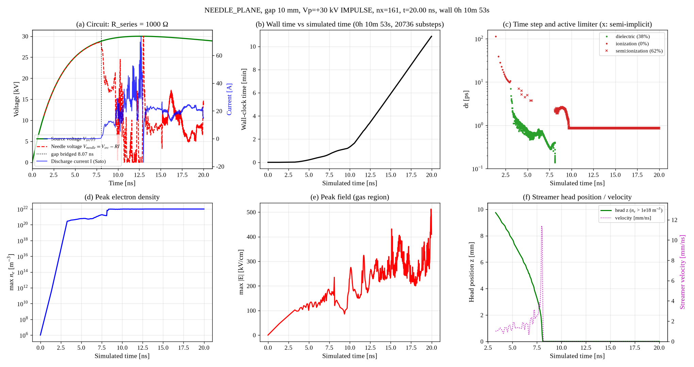

### 4.3 격자 세분 (nx = 321, 격자 321×249, h = 0.0625 mm, 미지수 72,422) — `results/run_default_nx321/`

| 항목 | 값 |
|---|---|
| 갭 브리징 | **t = 9.03 ns** (nx=161 의 8.07 ns 보다 12 % 늦음: 선단 반경 0.15 mm 가 2.4 셀로 분해되어 선단 전계가 낮아짐) |
| 방전 단계 서브스텝 / 벽시계 | 11,796 / **7 min 15 s** (36.9 ms/서브스텝, 포아송 35 %; LU 분해 1회 0.4 s) |
| dt | 평균 0.72 ps, 최소 0.23 ps (유전완화 98 %) |
| **총 소요** (잔광 10 µs 포함) | **7 min 21 s** (v17 은 셀 수 4배·반복수 증가로 브리징까지만 수 시간, 이후 진행 불가) |
| 브리징 시점 max \|E\| | 150 kV/cm |

셀 수 4배에 스텝 비용은 5.5배(직접해법의 fill-in 증가), 서브스텝 수는 1.5배로, 총 7.8배입니다.
nx = 641 이면 대략 1 시간 오더로 예상되어 여전히 24 시간 이내입니다.

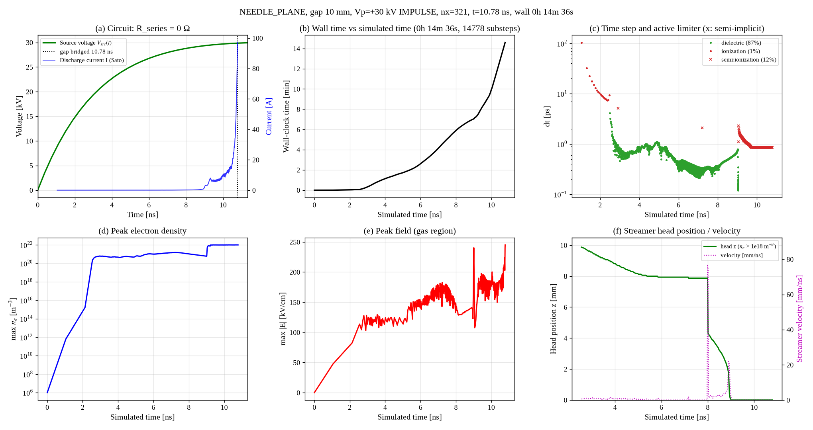
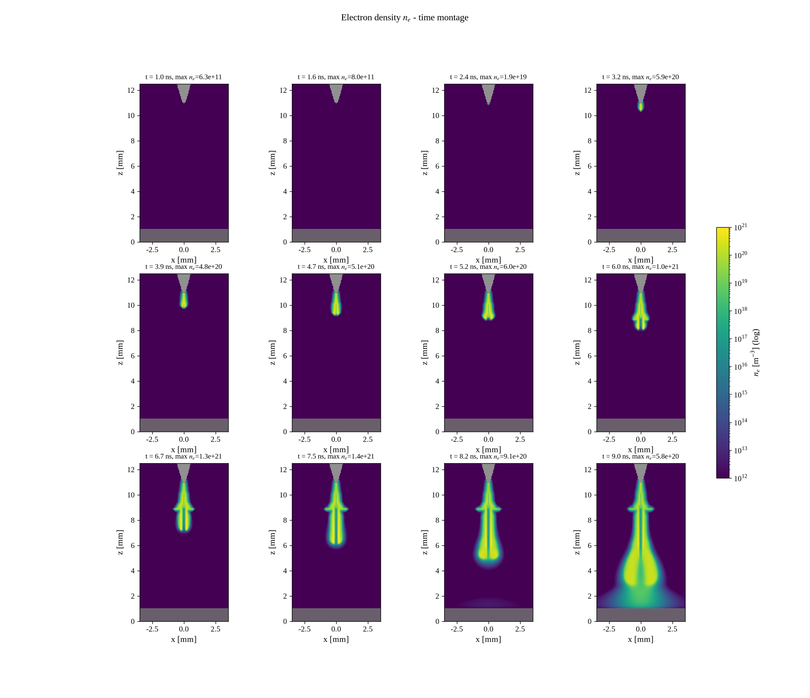

### 4.4 v17 대비 요약

| | v17 | v18 |
|---|---|---|
| 서브스텝당 (nx=161) | 74 ms | 6 ms (명시적) / ~25 ms (반암시적, 분해 재사용 포함) |
| 초기화 | 6.5 s | 0.1 s |
| 브리징까지 서브스텝 | 28,794 | 7,806 |
| 브리징까지 벽시계(헤드리스) | ≈ 35 min | 51 s |
| 브리징 이후 | dt 5 fs 로 붕괴, 진행 불가 | 자동 감지 → 잔광 (기본), 또는 R>0 회로로 300 ns 완주 (4 h 40 min; 단 ~10 ns 이후는 모델 유효범위 밖) |
| 포아송 해 | 미수렴(60회 SOR), 형상접지 구성 오류 | 정확해 |

## 5. 유의사항
* 브리징 이후(도전 채널·음극 강하) 단계는 이 등온 2D 유체 모델의 유효범위 밖입니다. R>0 옵션은 전류 제한과
  전압붕괴를 회로 수준에서 재현할 뿐, 채널 가열·음극 강하 물리는 포함하지 않으며 이온 밀도는 상한(1e22 m⁻³)에 걸립니다.
  변위전류(C·dV/dt)는 Sato 전류에 포함하지 않았습니다.
* 반응률 테이블·화학 상수·수송계수·격자·경계조건 등 물리 입력은 v17 과 동일합니다. dt 규칙만 §2-3 처럼 바뀌었고
  `dt_rule="v17"` 로 되돌릴 수 있습니다.
* nx 를 키우면 셀 수에 비례해 스텝 비용이, CFL 로 dt 가 줄어듭니다. 원래 조건에서 침 선단 반경(0.15 mm)이 격자(0.125 mm)
  와 비슷해 선단이 한 셀로 근사되므로, 정량 연구에는 nx ≥ 321 을 권합니다(§4.3).
